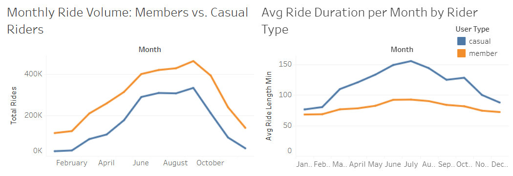
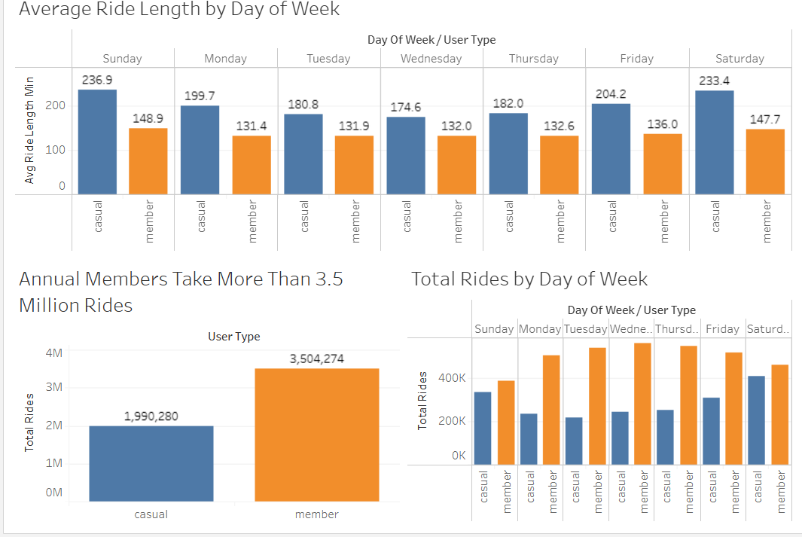

# 🚲 Cyclistic Case Study: Member vs. Casual Rider Behavior

This project analyzes 12 months of Cyclistic bike-share data to uncover differences in behavior between annual members and casual riders. The goal is to help Cyclistic's marketing team develop data-informed strategies for growing membership.

---

## 🔍 Tools Used
- **BigQuery (SQL):** Data cleaning, transformation, and aggregation
- **Tableau Public:** Interactive dashboard and visual storytelling

---

## 🔄 Project Process

1. **Data Collection:** Downloaded 12 months of Cyclistic ride data (CSV format).
2. **Data Cleaning:** Removed nulls and filtered out rides under 1 minute or over 6 hours to eliminate errors and outliers.
3. **Data Transformation:** Calculated ride duration and extracted day of week using SQL.
4. **Exploratory Analysis:** Aggregated and segmented ride data by user type, date, and usage behavior.
5. **Visualization:** Built an interactive dashboard in Tableau to clearly communicate trends and business opportunities.

---

## 🧰 Skills Demonstrated

- **SQL:** Data filtering, date/time functions, calculated fields, aggregation, and table creation
- **Data Cleaning:** Outlier removal, null handling, data type formatting
- **Tableau:** Grouped and stacked bar charts, line charts, calculated fields, color encoding, dashboard design
- **Data Storytelling:** Translating raw data into actionable business insights

---

## 📊 Key Insights

- **Annual members take significantly more rides**, especially on weekdays — suggesting commuter-style usage.
- **Casual riders take longer rides**, peaking on weekends — indicating leisure or recreational use.
- **Monthly ride volume** for both groups increases in summer, but member usage is more consistent year-round.

---

## ✅ Recommendations

1. **Target casual riders with weekend-focused membership promotions.**  
   Encourage sign-ups by promoting benefits for leisure riders.

2. **Promote membership as a cost-saving option for long or frequent riders.**  
   Highlight financial advantages to convert high-usage casual riders.

3. **Enhance weekday commuter infrastructure to support member retention.**  
   Improve station availability, particularly during peak commuting hours.

---

## 📈 Tableau Dashboard

👉 [View the Interactive Dashboard on Tableau Public](https://public.tableau.com/app/profile/brandon.ippolito/viz/CyclisticBikeUsageAnalysisMembervs_CasualRiders12-MonthOverview/Dashboard)

---

## 🧠 Summary

In this case study, I used SQL to process and clean Cyclistic trip data, then visualized insights using Tableau. I discovered clear usage patterns between member and casual riders, which informed three strategic business recommendations. This analysis is designed to support data-driven marketing and operational improvements for Cyclistic’s growth.

---
